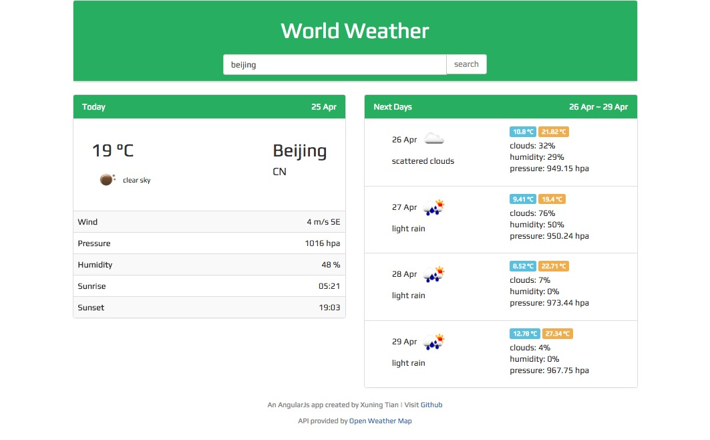

# world-weather app -- 一个AngularJS天气app



默认根据用户的地理位置显示天气，也可以输入具体城市查询天气。

API 由 [OpenWeatherMap](http://openweathermap.org/) 提供

## Demo 演示

演示地址 [demo](http://tianxuning.com/app/weatherapp/)


## Installation 安装

via git and npm

```
$ git clone git@github.com:txn513/weather-webapp.git [your-app-name]
$ cd [your-app-name]
$ npm install
```

## License

[The MIT License](http://opensource.org/licenses/MIT)

API provided by [OpenWeatherMap](http://openweathermap.org/)
